## Check the presence of retrogressive thaw slumps in multi-temporal images or animations

### Introduction

Retrogressive thaw slumps (RTSs) are a form of permafrost degradation drawing increased attention due to their significant impacts on local environments, northern communities, ecosystems, and even global processes like the carbon cycle. With ongoing climate warming, both the frequency and extent of RTSs have risen sharply in recent decades, as shown by numerous site-specific studies. However, comprehensive information about their regional patterns and long-term dynamics across the broader permafrost landscape remains limited, which hinders our ability to fully understand and predict permafrost degradation. Mapping RTS is challenging because they typically occur in remote, hard-to-access locations, are relatively small, and can resemble surrounding features in remote sensing data—making them difficult to distinguish both in the field and from satellite imagery.

Ground photos of retrogressive thaw slumps (RTSs), as shown in [Huang et al. 2022](https://www.mdpi.com/2072-4292/14/12/2747). **RTSs typically expand each year during the thaw season due to the melting of ground ice until they stabilize.**

**We invite volunteers to check whether RTSs are present in images or animations.** We generated tens of thousands of results—containing both true and false positives—across the Arctic and sub-Arctic from multi-temporal and multi-source remote sensing data using AI techniques. 
As shown in the screenshot and animations below, please inspect the images and GIFs on the left, then click Yes or No to indicate whether the result is a true or false positive, respectively. If the imagery is insufficient to determine the outcome (e.g., cloud cover or missing data), select Unknown.
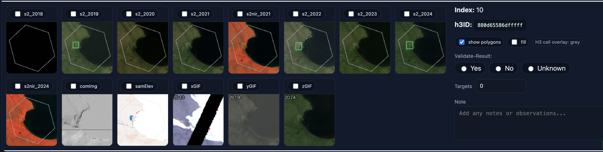^[s2: Sentinel-2 RGB images; s2nir: Sentinel-2 images with the near-infrared band replacing the red band; comImg: composite images derived from ArcticDEM; samElev: elevation differences derived from ArcticDEM. For comImg and samElev, see [Huang et at., 2023](https://doi.org/10.1016/j.isprsjprs.2023.10.008) for more information. Each image or animation covers a region of around 1.1 km by 1.1 km. ] 

The following are animations corresponding to the screenshot above. In these, a landslide-like feature connected to a lake expands annually. From the elevation-derived data (comImg and samElev), you can clearly see elevation reduction and expansion—this is a true positive (Yes).

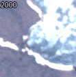

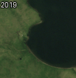

## How to
1.	Log in to [https://thawslump.yghlc.org/](https://thawslump.yghlc.org/) using your email address. We recommend using a computer with a large screen.
2.	After logging in, you can start checking RTS presence. By default, the system shows ten rows of images and animations. Review each set and click Yes, No, or Unknown based on your observations.
3.	Close the window to stop at any time, or click Next to load another group of data.

## Examples of true positives (Yes):

#### Example 1, multiple RTS expanding:

  

    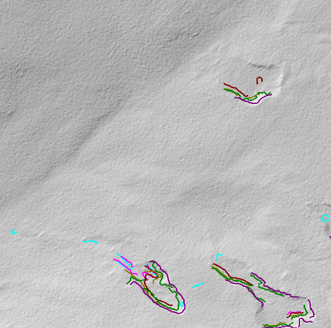
  

  

    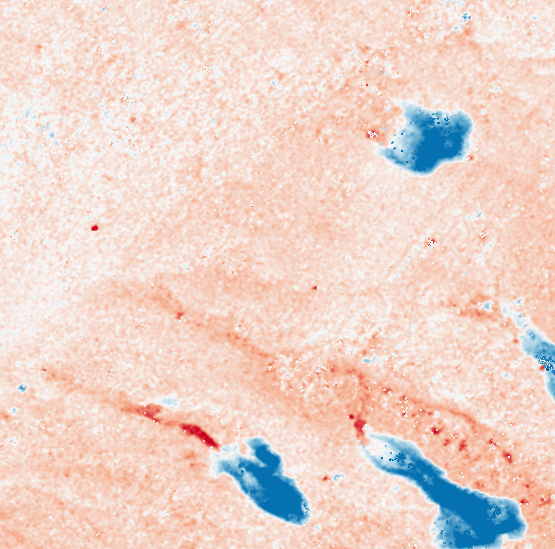
  

  

    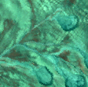
  

  

    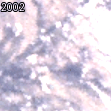
  

  

    
  

  

    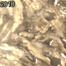
  

#### Example 2, RTS expanding (bottom right):

  

    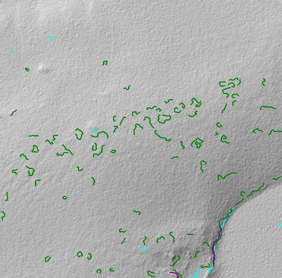
  

  

    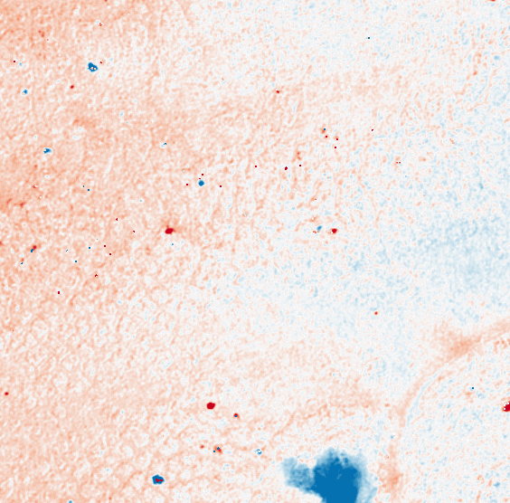
  

  

    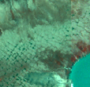
  

  

    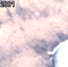
  

  

    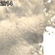
  

  

    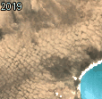
  

#### Example 3, RTS expanding (top middle and top right):

  

    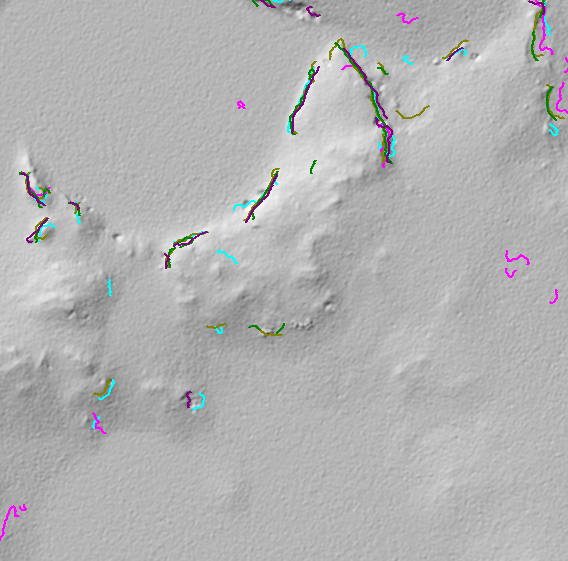
  

  

    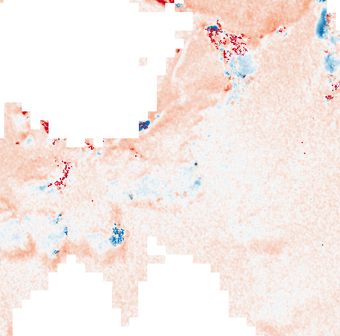
  

  

    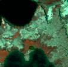
  

  

    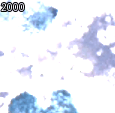
  

  

    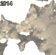
  

  

    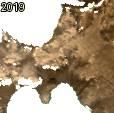
  

#### Example 4, RTS expanding (top middle):

  

    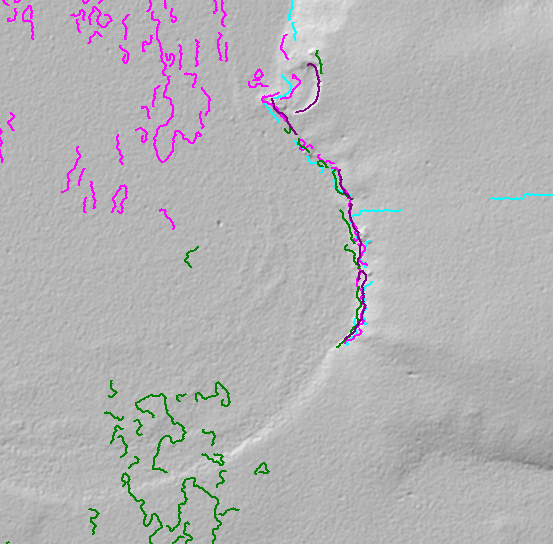
  

  

    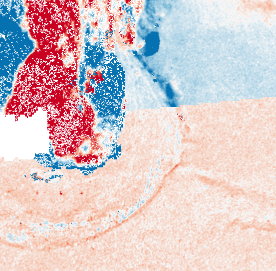
  

  

    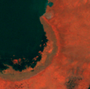
  

  

    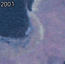
  

  

    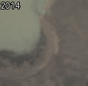
  

  

    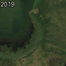
  

#### Example 5, RTS expanding (middle):

  

    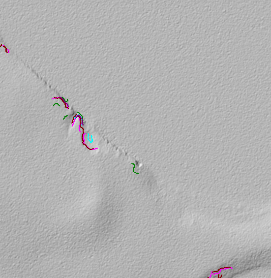
  

  

    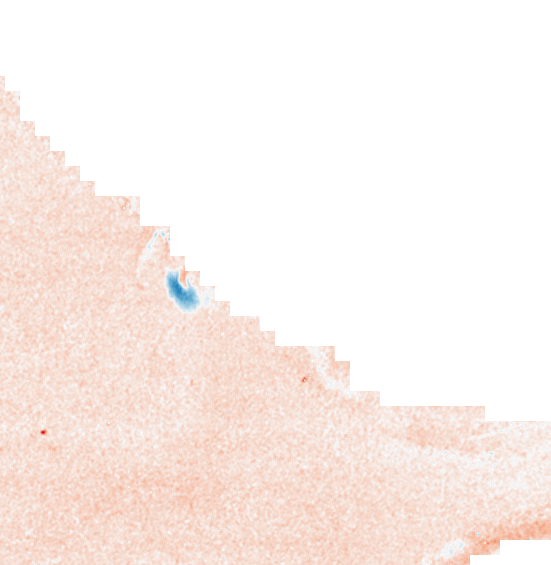
  

  

    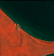
  

  

    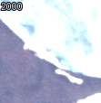
  

  

    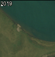
  

#### Example 6, RTS expanding (bottom left):

  

    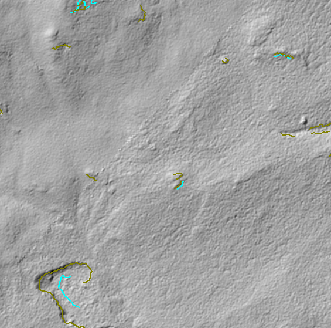
  

  

    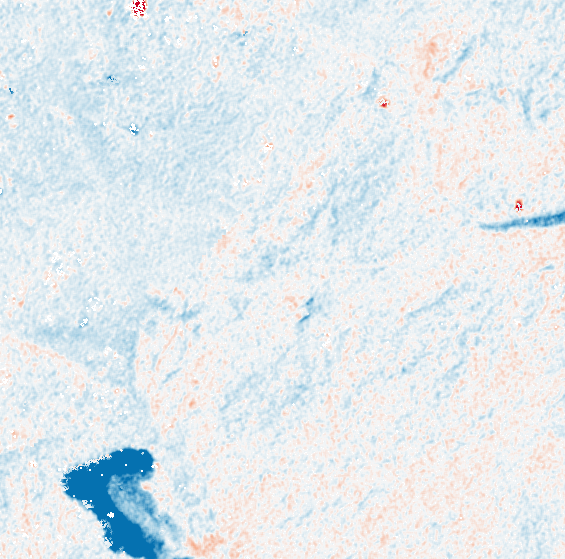
  

  

    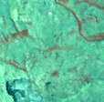
  

  

    
  

  

    
  

  

    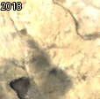
  

#### Example 7, RTS expanding (left middle):

  

    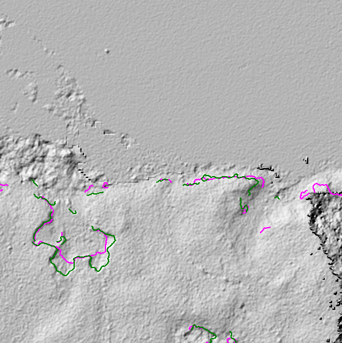
  

  

    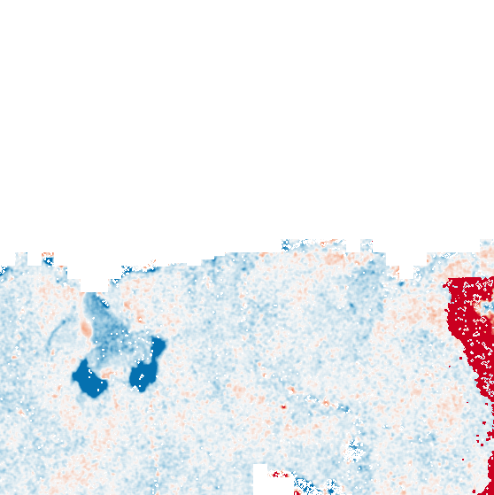
  

  

    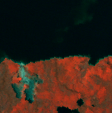
  

  

    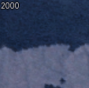
  

  

    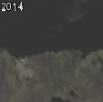
  

  

    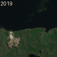
  

#### Example 8, RTS expanding (middle and top right):

  

    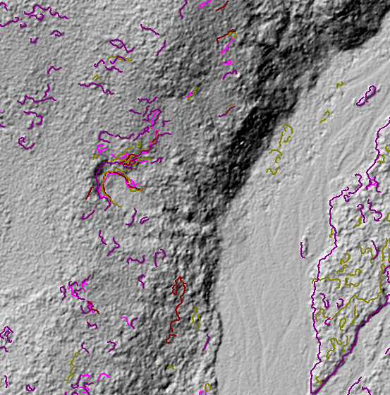
  

  

    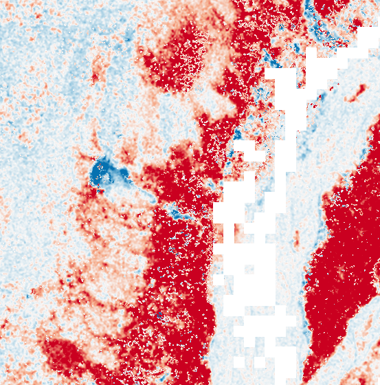
  

  

    
  

  

    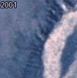
  

  

    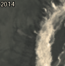
  

  

    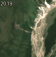
  

#### Example 9, RTS expanding (middle):

  

    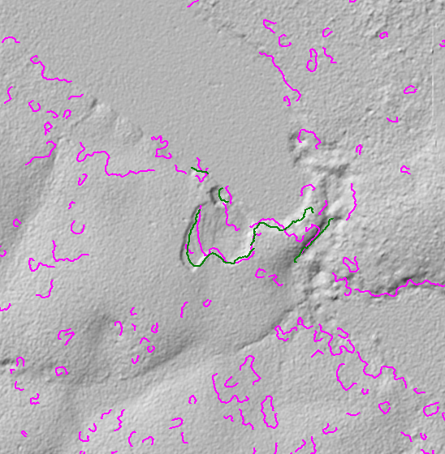
  

  

    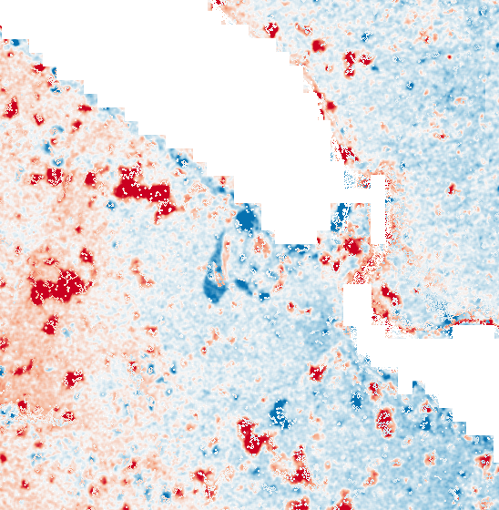
  

  

    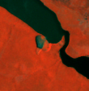
  

  

    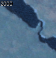
  

  

    
  

## Examples of false positives (No):

#### Example 1, outcrop, not RTSs:
<!-- Equal-size single row (no wrapping) -->

  

    
  

  

    
  

  

    
  

  

    
  

  

    
  

  

    
  

#### Example 2, outcrops or bare land, not RTSs:

  

    
  

  

    
  

  

    
  

  

    
  

  

    
  

  

    
  

#### Example 3, bare land, mining, or construction (roads connected), likely not RTSs:

  

    
  

  

    
  

  

    
  

  

    
  

  

    
  

  

    
  

#### Example 4, bare land, mining, or construction (roads connected), likely not RTSs:

  

    
  

  

    
  

  

    
  

  

    
  

  

    
  

#### Example 5, disturbances caused by river erosion, likely not RTSs:

  

    
  

  

    
  

  

    
  

  

    
  

  

    
  
  

  

    
  

#### Example 6, disturbances caused by river erosion, likely not RTSs:

  

    
  

  

    
  

  

    
  

  

    
  

  

    
  
  

  

    
  

#### Example 7, bare land, mining, or construction (roads connected), not RTSs:

  

    
  

  

    
  

  

    
  

  

    
  

  

    
  

### Contact
For bugs, comments, suggestions, or questions, please contact: [Lingcao Huang](https://yghlc.github.io/lingcaohuang) (lingcaohuang@cuhk.edu.hk).